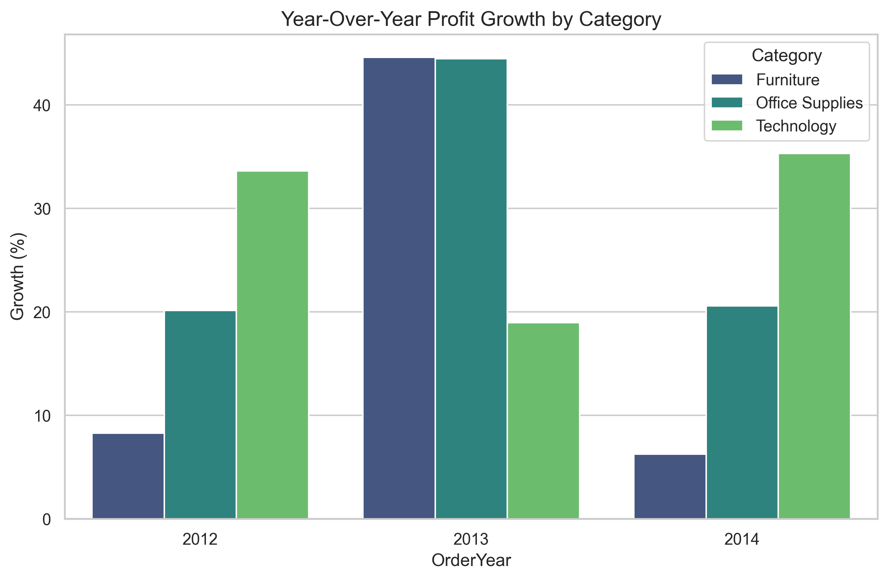
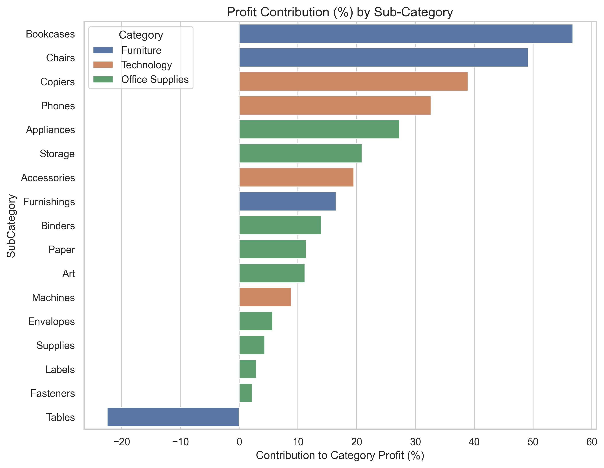
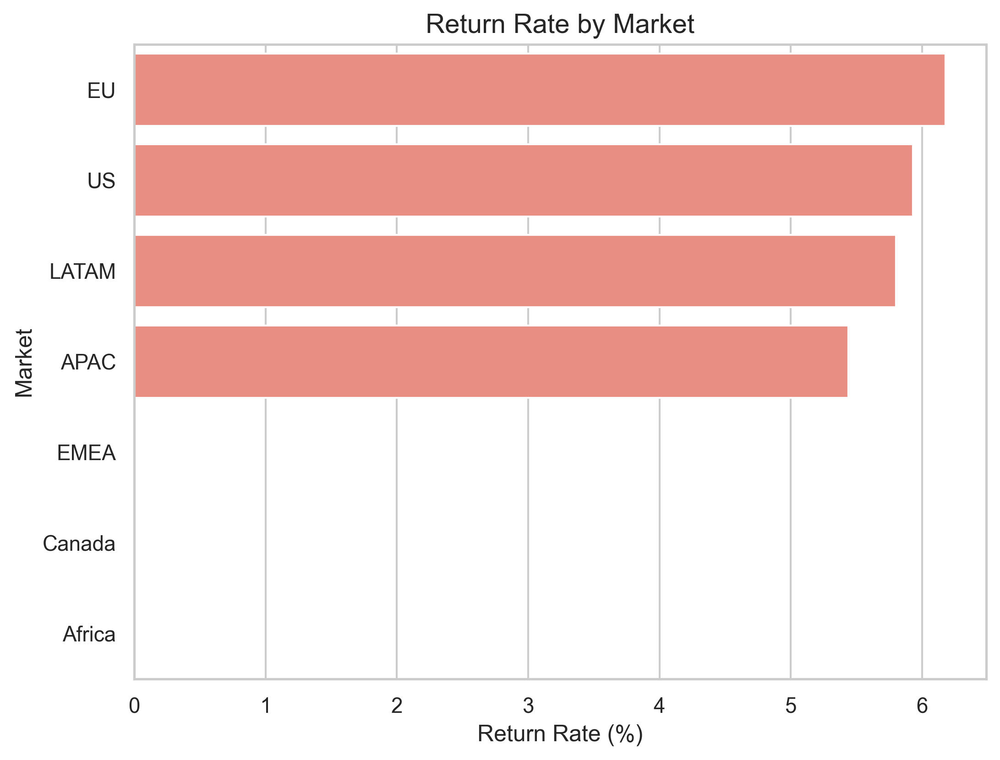

#  Strategic Profitability Analysis: Global Superstore

**Analyst:** Sidhardh Suresh
**Date:** November 2025
**Tech Stack:** Python (Pandas/Seaborn), SQL (SQLite), ETL Pipeline, Streamlit

---

## 1. Executive Summary & Technical Impact
This project engineered a robust **ELT pipeline** to analyze 50,000+ sales records. By utilizing **Advanced SQL Window Functions** and **Python-based validation**, I identified critical inefficiencies causing a **-22% profit drag** in key sectors.

**Top-Level Insights for Stakeholders:**
* **Profit Leakage Detected:** The "Furniture" category is bleeding revenue due to negative margins in the "Tables" sub-category.
* **Operational Inefficiency:** The EU Market shows a **6% Return Rate** (highest globally), signaling a logistics failure point.
* **Growth Volatility:** Year-over-Year (YoY) analysis reveals instability in 2014 growth, requiring immediate inventory adjustments.

---

## 2. Technical Analysis: The "Discount Trap"

*Query Logic: SQL Window Functions (`LAG`) to calculate Year-Over-Year Growth.*

**Strategic Finding:**
While Technology shows consistent scalability, **Furniture** exhibits volatile growth patterns. The crash in 2014 indicates that revenue is being driven by unsustainable discounting rather than organic demand.

**Recommendation:** Shift marketing budget from Furniture to Technology to capitalize on the higher stability and margin.

---

## 3. Technical Analysis: Margin Contribution

*Query Logic: SQL Window Functions (`SUM OVER PARTITION`) to calculate relative contribution.*

**Strategic Finding:**
**Tables** are the primary driver of losses, contributing **-22%** to the Furniture category's bottom line. Conversely, **Copiers** and **Phones** act as the profit anchors for the Technology sector.

**Recommendation:** Perform a SKU rationalization audit on "Tables." Consider discontinuing unprofitable SKUs to immediately boost category margins.

---

## 4. Technical Analysis: Logistics & Returns

*Query Logic: Complex `LEFT JOIN` between Orders and Returns tables.*

**Strategic Finding:**
The **EU Market** is an outlier with a **~6% Return Rate**, significantly higher than the global average. This suggests a systemic issue in the European supply chain (e.g., damaged shipping or poor product descriptions).

**Recommendation:** Initiate a root-cause analysis on EU logistics partners to reduce reverse-logistics costs.

---

## 5. Project Methodology (Engineering Standards)
This project follows rigorous software engineering standards to ensure reproducibility and scalability:

1.  **Modular ETL Architecture:** Raw data is processed via a dedicated Python pipeline (`src/data_processing.py`) before database loading.
2.  **Data Integrity:** Automated cleaning scripts handle type casting and missing value imputation (e.g., Postal Codes).
3.  **Automated Testing:** The data pipeline is verified using **Pytest** to prevent regression.
4.  **Version Control:** Semantic Git commit history ensures transparent development lifecycle.